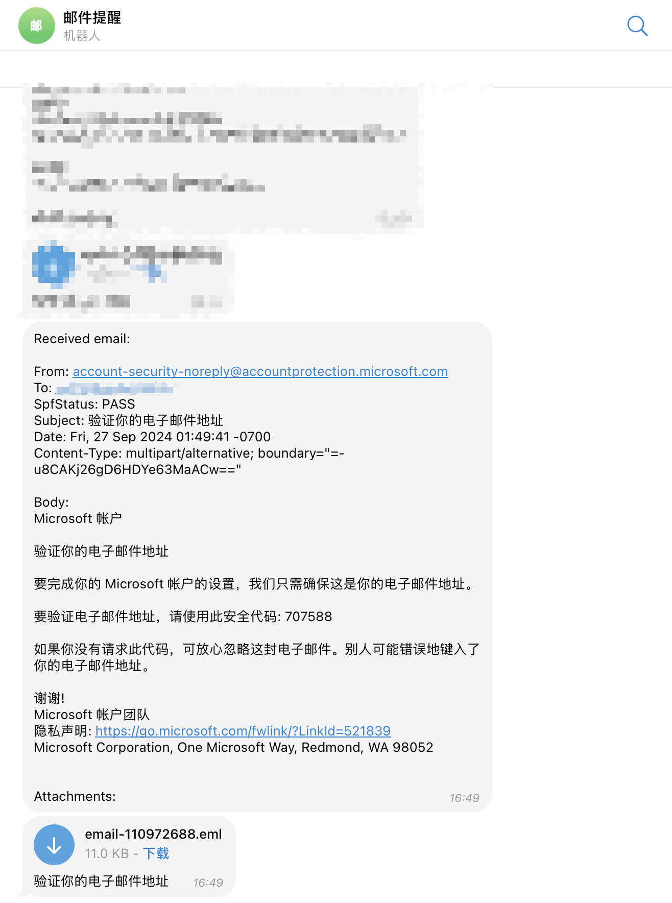
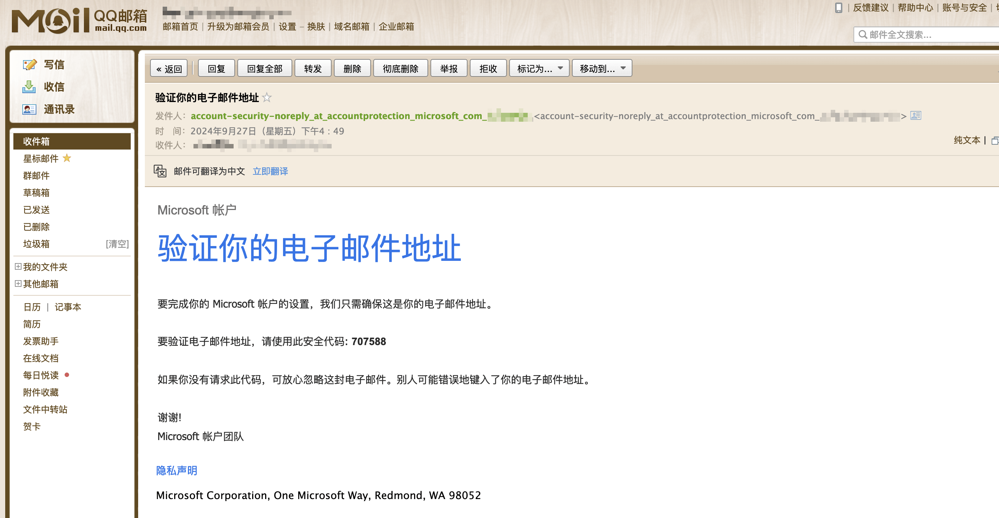

# EMAIL ROUTER

该项目是一个支持 **多域名 Catch-All 邮件收件** 的工具，所有收到的邮件都不会存储，直接转发。它可以将邮件转发到 **Telegram 机器人** 和 **私人邮箱地址**。该工具的设计灵感来源于 [DuckDuckGo Email Protection](https://duckduckgo.com/duckduckgo-help-pages/email-protection/) ，目标是提供一个完全自托管的解决方案。

## 功能介绍

- **Catch-All 邮件转发：** 支持将接收到的所有邮件直接转发到指定邮箱，而无需存储邮件内容。
- **Telegram 机器人通知：** 收到的邮件可通过 Telegram 机器人进行实时通知。

- **多域名支持：** 可以跨多个域名进行邮件转发处理。
- **SMTP 邮件发送：** 提供邮件发送功能，可以通过你定义的**私人邮箱地址**将邮件转发给指定的收件人。


## 部署步骤


### 前置准备

#### 1. 服务器准备
公网IP（以223.223.223.223为例），25端口可达 (可以通过本项目内的`check_port_25_connectivity.sh`进行测试) ，服务器安装好Docker，设置PTR记录（可选，如果只收信则不需要）
#### 2. 域名准备
想要使用的域名（以404.local、403.local为例）  

主域名需要设置MX服务器的A记录、MX记录、SPF记录。
```txt
;; A Records
mx1.404.local.	1	IN	A	223.223.223.223

;; MX Records
404.local.	1	IN	MX	5 mx1.404.local.

;; TXT Records
404.local.	1	IN	TXT	"v=spf1 ip4:223.223.223.223 -all"
```
其他域名需要设置MX记录，SPF记录跟随主域名
```txt
;; MX Records
403.local.	1	IN	MX	5 mx1.404.local.

;; TXT Records
403.local.	1	IN	TXT	"v=spf1 include:404.local -all"
```
（不一定非要mx1前缀，任意都可）
### 1. 克隆仓库

```bash
git clone https://github.com/yumusb/email_router.git
cd email_router/deploy
```

### 2. 证书相关配置

项目使用`acme.sh`提供证书，以保证收信过程中的安全。打开 .env 配置文件
```config
DNS_API=dns_cf #目前指定了CF，后续可能完善逻辑
ACME_SH_EMAIL= #随便一个邮箱，用来初始化acme账户
MXDOMAIN= #mx服务器的域名，用来申请证书，按照本文中的例子就需要是mx1.404.local
CF_Token= # 权限需要可以操作 404.local的DNS解析
CF_Zone_ID= # 404.local的Zone ID
```
### 3. config.yml配置
```yml
telegram:
  bot_token: "<你的_bot_token>"
  chat_id: "<你的_chat_id>"

smtp:
  listen_address: "0.0.0.0:25"
  listen_address_tls: "0.0.0.0:587"
  allowed_domains:
    - "404.local"
    - "403.local"
  cert_file: "/cert/fullchain.pem"
  key_file: "/cert/key.pem"
  private_email: "root123645@foxmail.com"
```
需要修改的有 telegram相关，allowed_domains修改为自己的域名，private_email修改为要转发到的邮箱。
### 4. 启动
```shell 
docker compose up -d 
```
由于初次启动需要申请证书，所以需要一点时间来启动，只有有效的证书才能启动邮件服务。
### 5. 收件
为防止出现未知问题，程序对收件地址的规则做了限制。允许的收件地址规则为`^(\w|-)+@.+$`  
例如以下：
> root@404.local  
> 404@404.local  
> my-admin@404.local  
> random@404.local  

可以结合`Bitwarden`中的用户名生成器，效果更佳。
可以通过自己的其他邮箱向域名邮箱进行发信测试，不出意外应该可以收到来自自己域名转发的邮件。

### 6. 发件
与[DuckDuckGo Email Protection](https://duckduckgo.com/duckduckgo-help-pages/email-protection/duck-addresses/how-do-i-compose-a-new-email/) 的逻辑一样
> For example, if your personal Duck Address is jane@duck.com and you want to send to your friend’s email brian@gmail.com. To send the email from your personal Duck Address, you would send the message to brian_at_gmail.com_jane@duck.com.  

其中 jane 可以是你喜欢的、你需要的 任意前缀，因为这是你的域名。  
同样的，直接回复收到的转发的来信，服务器也会帮你自动转发回去。  

需要注意的是，发信非常依赖信誉，你的IP信誉、域名信誉、PTR设置等。如果你发现私人邮箱收到的邮件在垃圾箱，可以手动加白下，很有可能发送给别人的也进了垃圾箱。


## 其他问题
### todo 
- [x] spf check
- [ ] 证书自动续期相关逻辑